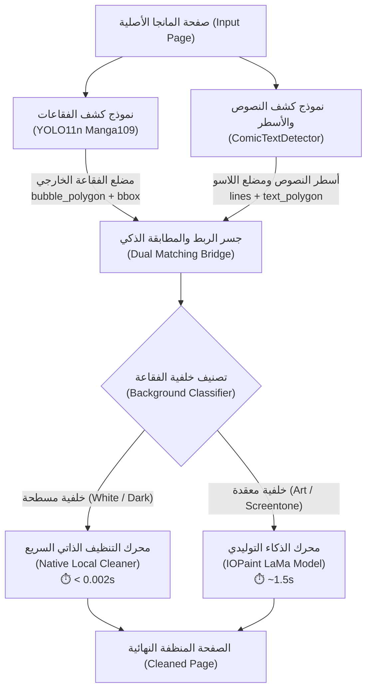

# الدليل التقني والهندسي للتنظيف الذاتي والربط ثنائي النماذج
# Native Cleaning Architecture & Dual-Model Pipeline
**مشروع SmartCleaner-AI**

---

## 🌟 1. مقدمة وفلسفة النظام (System Philosophy)

في معالجة وتبييض المانجا والويب تون والكوميكس، تنقسم فقاعات الكلام واللوحات إلى نوعين أساسيين:
1. **فقاعات مسطحة صريحة (Flat Bubbles):** تكون خلفيتها بيضاء نقية (`flat_white`) أو داكنة مصمتة (`flat_dark`). وتشكل هذه الفئة أكثر من **85%** من محتوى أي عمل مصور.
2. **مناطق معقدة ورسومية (Complex / Screentone / Art):** تحتوي على خلفيات شبكية (Screen tones) أو مؤثرات رسم أو نصوص فوق تفاصيل شخصيات وخلفيات.

### ❓ لماذا ابتكرنا "التنظيف الذاتي / النيتف" (Native Local Cleaning)؟
* **السرعة الخارقة:** إعادة الرسم بنماذج الانتشار والذكاء الاصطناعي التوليدي مثل LaMa تستغرق ما بين ثانية إلى ثانيتين لكل فقاعة وتتطلب عتاد كارت شاشة (GPU). في المقابل، المعالجة الذاتية (Native) تنفذ التبييض في أقل من **0.002 ثانية** على المعالج المركزي العادي (CPU)، مما يتيح تبييض فصل كامل (50-100 صفحة) في ثوانٍ معدودة.
* **النقاء التام (Pure Solid Background):** نماذج الـ Inpainting التوليدية قد تُنتج أحياناً تدرجات باهتة (Artifacts) أو تشويشاً طفيفاً في البكسلات البيضاء؛ بينما يضمن التنظيف الذاتي بياضاً ناصعاً بنسبة 100% بلون رقمي موحد `(255, 255, 255)`.
* **الحفاظ المطلق على الحواف (0px Border Erosion):** التحدي الأكبر كان دائماً: كيف نمسح النص وعلامات الترقيم بالكامل بدون تآكل بكسل واحد من حواف الفقاعة أو أسنان فقاعات الصراخ؟ وهنا يأتي دور **المعمارية ثنائية الإحداثيات**.

---

## 🧩 2. المعمارية ثنائية الإحداثيات (Dual-Coordinate Architecture)

يعتمد النظام على التعاون التزامني بين نموذجي ذكاء اصطناعي متخصصين ومستقلين، بحيث يغطي كل نموذج نقطة ضعف الآخر:

### 1. النموذج الأول: كاشف الفقاعات (Bubble Detector)
* **النموذج الأساسي:** `yolo11n-manga109-bubble.pt` (مبني على بنية YOLO11 الأحدث عالمياً ومدرب على ألوف صفحات المانجا والويب تون).
* **النموذج المساعد:** `comic-speech-bubble-detector.pt`.
* **مهمته:**
  * اكتشاف الإطار الهندسي الكامل للفقاعة (`bbox: [x, y, w, h]`).
  * استخراج مضلع حدود الفقاعة المتعرجة (`bubble_polygon`) الذي يحمي حافة الفقاعة الخارجية من التآكل.

### 2. النموذج الثاني: كاشف النصوص والأسطر (Text & Line Detector)
* **النموذج:** `comictextdetector.pt.onnx`.
* **مهمته:**
  * اكتشاف الكتل النصية ومواقعها بدقة متناهية.
  * استخراج كل سطر كـ مضلع مستقل (`lines`).
  * تجميع الأسطر وتوليد مضلع اللاسو المحكم (`generate_bubble_lasso_polygons`) الذي يلتف حول الكلمات فقط تاركاً مسافة أمان كاملة بينه وبين حواف الفقاعة.

### 3. جسر الربط والمطابقة (The Dual Matching Bridge)
في ملف [`fast_cleaner.py`](file:///g:/project/SmartCleaner-AI/fast_cleaner.py):
* يقوم الجسر بمطابقة النصوص مع الفقاعات التي تحتويها بالاعتماد على التداخل المكاني (`Intersection over Area / Bounding Containment`).
* النتيجة تكون كائناً غنياً بكل فقاعة يحتوي على:
  * إحداثيات ومضلع الفقاعة الخارجي (`bubble_polygon`).
  * إحداثيات ومضلعات الأسطر النصية الدقيقة (`lines`).
  * مضلع الإحاطة النصي (`polygon` / `polygons`).

---

## ⚙️ 3. مراحل المعالجة الذاتية بالتفصيل (Native Step-by-Step)

يتم تنفيذ التنظيف الذاتي عبر الدوال المركزية في [`pcleaner/iopaint_client.py`](file:///g:/project/SmartCleaner-AI/pcleaner/iopaint_client.py):

### المرحلة 1: التصنيف التكيفي للخلفية (Background Classification)
عبر الدالة `classify_bubble_background`:
1. تُحلل البكسلات المحصورة بين مضلع النص وحافة الفقاعة.
2. تُحسب نسبة البكسلات البيضاء (`total_white_ratio`) ونسبة البكسلات الداكنة (`dark_ratio`).
3. **قرار التوجيه:**
   * إذا كانت النسبة البيضاء $\ge 65\%$ تُصنف كـ `flat_white`.
   * إذا كانت الفقاعة داكنة أو عاكسة (نص أبيض على أرضية سوداء) تُصنف كـ `flat_dark`.
   * إذا احتوت على تدرجات رمادية أو راستر (Screentone) أو رسومات، يتم تحويلها فوراً إلى محرك **IOPaint (LaMa)** لإعادة بنائها ذكائياً.

---

### المرحلة 2: بناء قناع النص المتعرج (Contour-Following Text Mask)
* **المشكلة السابقة:** استخدام مستطيل الإحاطة القائم الزوايا (90°) كان يتسبب في اختراق زوايا المستطيل لأركان الفقاعات البيضاوية وأسنان فقاعات الصراخ.
* **الحل المعتمد:**
  1. رسم مضلعات الأسطر النصية عبر `cv2.fillPoly` بناءً على مصفوفة `lines`.
  2. إنشاء نطاق بحث ملاصق للكلمات فقط باتساع شعاعي **12 بكسل** (`cv2.dilate` بيضاوي).
  3. التقاط علامات الترقيم (النقاط، الفواصل، الشرطات، علامات التعجب `..!` أو `؟`) المحصورة **حصراً** داخل نطاق الـ 12 بكسل الملاصق للنص، مع حظر التقاط أي بكسلات حبر بعيدة عن مسار الكلمات.

---

### المرحلة 3: درع الحماية وحاجز الأمان (Dynamic Border Shield)
عبر الدالة `compute_safe_bubble_text_mask`:
1. **عزل الحواف الهيكلية:** تُحلل بكسلات الحبر بتقنية المكونات المتصلة (`cv2.connectedComponentsWithStats`). الحواف الكبيرة أو التي تلمس حدود الاقتصاص تُثبت كـ `border_mask`.
2. **حماية فقاعات الصراخ (Spiky / Burst Bubbles):**
   * فقاعات الصراخ تتكون من مئات الأسنان الحادة المستقلة التي تشع نحو الداخل.
   * تم وضع شرط صارم: **لا يُعتبر أي عنصر أسود كعلامة ترقيم إلا إذا كان صغيراً وملاصقاً مباشرة لأسطر النص المكتشفة**.
   * أي أسنان أو نتوءات تبتعد عن مسار النص تُصنف تلقائياً كحواف محمية حتى لو كانت منفصلة في الهواء.
3. **درع الصد (The Shield):**
   * يتم توسيع حواف الفقاعة بمقدار 2 بكسل لتكوين منطقة عازلة `shield`.
   * يتمدد قناع النص بمقدار الأمان المطلوب (Padding / Dilation = 5px)، وتُطبق عليه معادلة الأمان:
     $$\text{Safe Clean Mask} = (\text{Dilated Text} \setminus \text{Shield}) \setminus \text{Border Mask}$$
   * تضمن هذه المعادلة الرياضية استحالة وصول التبييض إلى حدود الفقاعة مهما كانت درجة التوسيع (Dilation).

---

### المرحلة 4: التعبئة الذاتية وتطابق الألوان (Adaptive Color Fill)
بدلاً من ملء البقع بلون ثابت قد لا يطابق درجة الصفحة أو الفقاعة:
1. **الفقاعات البيضاء (`flat_white`):**
   - يستخرج الكود اللون الإحصائي الوسيط (`np.median`) من المساحات النظيفة داخل الفقاعة المستثناة من القناع والحواف.
   - إذا كان اللون نقياً (> 235) يُضبط على الأبيض المطلق `[255, 255, 255]`.
2. **الفقاعات السوداء والداكنة (`flat_dark`):**
   - في الفقاعات السوداء، ينعكس منطق الحبر تلقائياً: يتم عزل الحروف البيضاء بدقة (`gray_roi > 130`).
   - تُعزل الحواف البيضاء للفقاعة أو الإطار الخارجي وتُحمى بواسطة درع الأمان (`Border Shield`).
   - تُقاس درجة السواد الحقيقية لأرضية الفقاعة عبر الوسيط الإحصائي للمناطق السليمة (`gray_roi < 85`).
   - إذا كانت الأرضية سواداً خالصاً ($\le 25$) يتم الطلاء بالأسود الصافي `[0, 0, 0]` فورياً في أقل من **0.002 ثانية** بدون استهلاك كارت الشاشة، مع الحفاظ على الحواف بنسبة 100%.
3. تُسند البكسلات الجديدة إلى مصفوفة الصورة فورياً بزمن تشغيل $O(1)$.

---

## 📊 4. جدول مقارنة: التنظيف الذاتي (Native) مقابل الذكاء التوليدي (AI Inpaint)

| وجه المقارنة | التنظيف الذاتي (Native Fast Cleaner) | الذكاء الاصطناعي (IOPaint LaMa) |
| :--- | :--- | :--- |
| **السرعة لكل فقاعة** | **< 0.002 ثانية** (فوري) | **1.0 - 2.0 ثانية** |
| **زمن معالجة صفحة كاملة** | **~0.05 ثانية** | **10 - 25 ثانية** |
| **استهلاك العتاد** | خفيف جداً على المعالج (CPU Only) | يستهلك كارت الشاشة (GPU VRAM) |
| **دقة لون الخلفية** | نقاء تام 100% بلون موحد بدون شوشرة | ممتاز ولكن قد ينتج تدرجات طفيفة |
| **سلامة الحواف** | **0 بكسل تآكل** ومحمي رياضياً بدرع أمان | قد يُحدث ضبابية طفيفة عند الحواف |
| **الاستخدام الأمثل** | الفقاعات البيضاء والفقاعات المسطحة الداكنة | المؤثرات، الراستر، وتفاصيل الرسم المعقدة |

---

## 🛡️ 5. الحالات الاستثنائية التي يعالجها النظام (Handled Edge Cases)

1. **فقاعات الصراخ والانفجار (Burst / Spiky Screaming Bubbles):**
   * مشكلتها السابقة: كانت أطراف الأسنان الداخلية تؤكل بسبب زوايا المربعات المستطيلة.
   * حلها الحالي: اقتصار قناع المسح على المضلع المحيط بالنص (Lasso) مع درع أمان محكم يمنع الاقتراب من الأسنان.
2. **الفقاعات الداكنة والمعكوسة (Inverted / Dark Bubbles):**
   * يتعرف عليها النظام تكيفياً تلقائياً، ويعكس منطق الحبر (استخراج النصوص البيضاء على الأرضية السوداء).
3. **علامات الترقيم المتطرفة (Exclamation Marks / Dots):**
   * تلتقطها خوارزمية البحث الملاصق (12 بكسل) دون ترك أي بكسلات مهملة مثل `..!` أو النقاط السفلية.
4. **الأسطر الطويلة الملاصقة لحدود الفقاعة:**
   * يفصل درع الحماية (`Border Shield`) بين آخر حرف وحافة الفقاعة ليمنع التداخل حتى عند المسافات الصفرية.

---

## 📁 6. خريطة الملفات المسؤولة في الكود المصدري

* [`pcleaner/iopaint_client.py`](file:///g:/project/SmartCleaner-AI/pcleaner/iopaint_client.py):
  * `clean_flat_bubble_locally()`: محرك التنظيف الذاتي الفوري.
  * `compute_safe_bubble_text_mask()`: خوارزمية فصل الحواف ودرع الأمان.
  * `smart_adaptive_inpaint_page()`: موجه التوزيع الذكي بين التنظيف الذاتي ومحرك IOPaint.
  * `generate_bubble_lasso_polygons()`: مولد مضلعات اللاسو المحكمة لأسطر النصوص.
* [`pcleaner/bubble_detector.py`](file:///g:/project/SmartCleaner-AI/pcleaner/bubble_detector.py):
  * `load_bubble_detector()`: تحميل وإدارة نماذج YOLO11n Manga109 و Comic Bubble.
* [`fast_cleaner.py`](file:///g:/project/SmartCleaner-AI/fast_cleaner.py):
  * `detect_bubbles_for_cleaning()`: جسر التنسيق بين كشف النصوص وكشف الفقاعات ودمج إحداثياتهما.
* [`gui_cleaner.py`](file:///g:/project/SmartCleaner-AI/gui_cleaner.py):
  * `BatchCleanerWorker`: خيط المعالجة المجمعة في الخلفية مع شريط التقدم الفوري.
  * `CanvasScene`: الواجهة الرسومية التفاعلية مع عرض مضلعات اللاسو الخضراء الحية.
